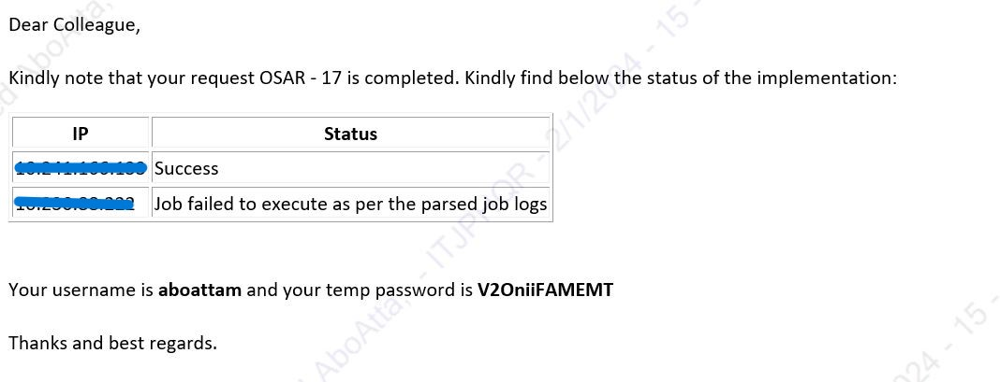
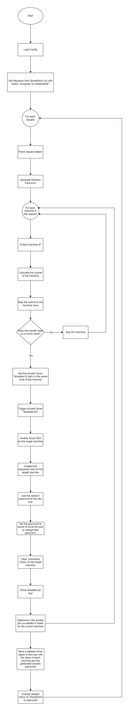

[![LinkedIn][linkedin-shield]][linkedin-url]

<!-- PROJECT LOGO -->
 

  
  <h3 align="center">Automated User Management with Ansible</h3>

<!-- TABLE OF CONTENTS -->

  
Table of Contents

  <ol>
    <li>
      <a href="#about-the-project">About The Project</a>
      <ul>
        <li><a href="#business-case">Business Case</a></li>
        <li><a href="#technical-solution">Technical Solution</a></li>
        <li><a href="#flowchart">Flowchart</a></li>
        <li><a href="#tech-stack">Tech Stack</a></li>
      </ul>
    </li>
    <li><a href="#contact">Contact</a></li>
  </ol>

<!-- ABOUT THE PROJECT -->
## About The Project

* **Project Name:** Automated User Management with Ansible  
* **Version:** v1.0.0  
* **Department:** Technology

---

### Business Case

Managing user access across a large number of machines in our organization has become increasingly complex and time-consuming. With over 2000 machines, the system administration team faces significant challenges in handling user creation requests efficiently.

This project was developed to streamline and automate the user creation process, reducing manual effort, ensuring consistency, and improving the overall efficiency of user management across the organization.

(<a href="#readme-top">back to top</a>)

### Technical Solution

The project automates the user creation process by leveraging Ansible Tower and SharePoint. Once a user creation request is approved, the system extracts the relevant details from SharePoint, identifies the machine's zone, and triggers an Ansible Tower template via API. The template initiates the user creation process on the specified machine without manual intervention.

(<a href="#readme-top">back to top</a>)

### Flowchart

(<a href="#readme-top">back to top</a>)

### Tech Stack

This project was developed using the following tech stack:

* **Python**
* **Ansible**

(<a href="#readme-top">back to top</a>)

<!-- CONTACT -->
## Contact

Mohamed AbdelGawad Ibrahim - [@m-abdelgawad](https://www.linkedin.com/in/m-abdelgawad/) - <a href="tel:+201069052620">+201069052620</a>

(<a href="#readme-top">back to top</a>)

<!-- MARKDOWN LINKS & IMAGES -->
[linkedin-shield]: https://img.shields.io/badge/-LinkedIn-black.svg?style=for-the-badge&logo=linkedin&colorB=555
[linkedin-url]: https://www.linkedin.com/in/m-abdelgawad/
